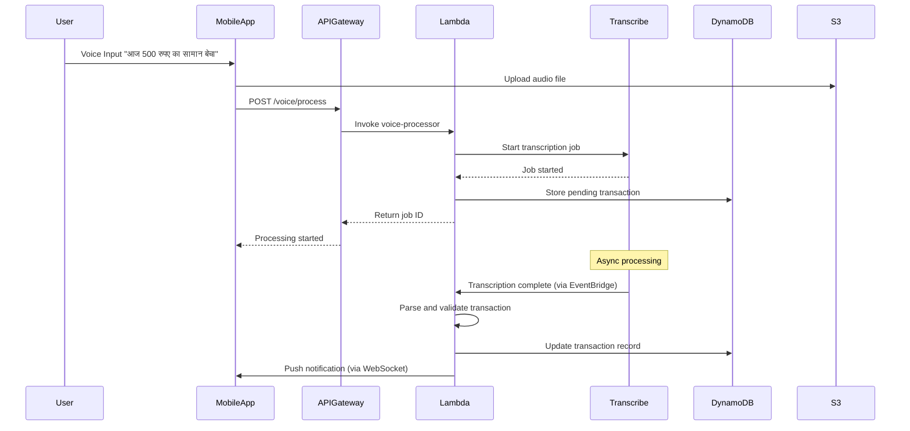
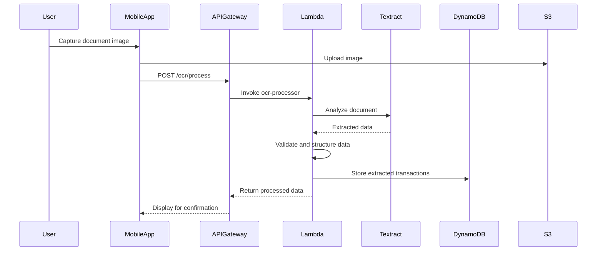
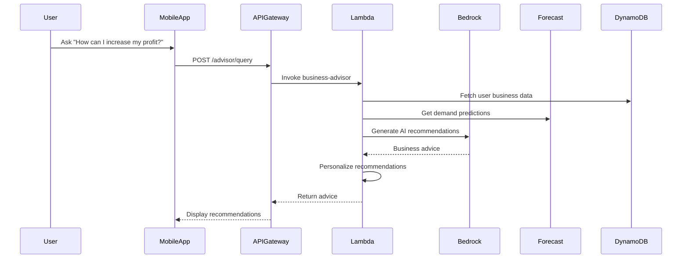

# VyapariAI – AI MBA Business Copilot for Bharat

## System Architecture Overview

VyapariAI is a **serverless, cloud-native AI system** built entirely on AWS services, designed to transform small and rural Indian businesses through voice-first interactions and intelligent document processing. The architecture leverages AWS's managed AI/ML services to provide MBA-level business intelligence while maintaining cost-effectiveness and scalability for millions of users across India.

**Core AWS Architecture Principles:**
- **100% Serverless**: Built using AWS Lambda, API Gateway, and managed services for zero infrastructure management
- **AI-First Design**: Integrated AWS AI services (Transcribe, Textract, Bedrock, Forecast) for intelligent processing
- **Event-Driven Processing**: Asynchronous workflows using AWS EventBridge and Lambda triggers
- **Multi-Language Support**: AWS Transcribe and Bedrock for Hindi and regional Indian languages
- **Cost-Optimized**: Pay-per-use AWS services aligned with small business economics

## High-Level Architecture Diagram Description

```
┌─────────────────────────────────────────────────────────────────────────────┐
│                        VyapariAI AWS Architecture                            │
├─────────────────────────────────────────────────────────────────────────────┤
│                                                                             │
│  ┌─────────────────┐                                                        │
│  │   Frontend      │                    AWS Cloud Services                  │
│  │  (Mobile/Web)   │    ┌──────────────────────────────────────────────┐   │
│  │                 │    │                                              │   │
│  │ • Voice Input   │◄──►│  ┌─────────────┐  ┌─────────────────────────┐ │   │
│  │ • Image Upload  │    │  │API Gateway  │  │     AWS Lambda          │ │   │
│  │ • Offline Sync  │    │  │             │  │                         │ │   │
│  └─────────────────┘    │  │ • REST APIs │  │ • Voice Processor       │ │   │
│                         │  │ • WebSocket │  │ • OCR Processor         │ │   │
│                         │  │ • Auth      │  │ • Business Logic        │ │   │
│                         │  └─────────────┘  │ • AI Orchestrator       │ │   │
│                         │         │         └─────────────────────────┘ │   │
│                         │         │                        │            │   │
│                         │         ▼                        ▼            │   │
│                         │  ┌─────────────┐  ┌─────────────────────────┐ │   │
│                         │  │  AWS IAM    │  │    AWS AI/ML Services   │ │   │
│                         │  │   Cognito   │  │                         │ │   │
│                         │  │             │  │ • Amazon Transcribe     │ │   │
│                         │  │ • Auth      │  │ • Amazon Textract       │ │   │
│                         │  │ • Users     │  │ • Amazon Bedrock        │ │   │
│                         │  └─────────────┘  │ • Amazon Forecast       │ │   │
│                         │         │         └─────────────────────────┘ │   │
│                         │         │                        │            │   │
│                         │         ▼                        ▼            │   │
│                         │  ┌─────────────┐  ┌─────────────────────────┐ │   │
│                         │  │ DynamoDB    │  │      Amazon S3          │ │   │
│                         │  │             │  │                         │ │   │
│                         │  │ • Sales     │  │ • Voice Files           │ │   │
│                         │  │ • Inventory │  │ • Document Images       │ │   │
│                         │  │ • Users     │  │ • Business Reports      │ │   │
│                         │  │ • Analytics │  │ • ML Model Data         │ │   │
│                         │  └─────────────┘  └─────────────────────────┘ │   │
│                         │         │                                     │   │
│                         │         ▼                                     │   │
│                         │  ┌─────────────┐                             │   │
│                         │  │ QuickSight  │                             │   │
│                         │  │             │                             │   │
│                         │  │ • Dashboards│                             │   │
│                         │  │ • Reports   │                             │   │
│                         │  │ • Analytics │                             │   │
│                         │  └─────────────┘                             │   │
│                         └──────────────────────────────────────────────┘   │
└─────────────────────────────────────────────────────────────────────────────┘
```

**AWS Service Integration Points:**
- **Amazon API Gateway**: Single entry point for all client requests with built-in throttling and caching
- **AWS Lambda**: Serverless compute for all business logic processing
- **Amazon DynamoDB**: NoSQL database for high-performance data storage and retrieval
- **Amazon S3**: Object storage for voice recordings, document images, and generated reports
- **Amazon Transcribe**: Multi-language speech-to-text conversion for voice inputs
- **Amazon Textract**: OCR processing for handwritten and printed business documents
- **Amazon Bedrock**: Large Language Model integration for AI-powered business advice
- **Amazon Forecast**: Time-series forecasting for demand prediction and inventory optimization
- **Amazon QuickSight**: Business intelligence dashboards and automated report generation
- **AWS IAM & Cognito**: Identity management and secure access control

## Component-wise Design

### Frontend Layer

**Technology Stack:**
- **React Native/Progressive Web App**: Cross-platform mobile application
- **AWS Amplify**: Frontend hosting, authentication, and API integration
- **Offline-First Architecture**: Local storage with AWS AppSync for synchronization

**Core Features:**
- Voice recording with real-time feedback
- Camera integration for document capture
- Offline transaction storage with background sync
- Multi-language UI supporting Hindi and regional languages
- Progressive loading for low-bandwidth environments

**AWS Integration:**
- **AWS Cognito**: User authentication and session management
- **AWS AppSync**: Real-time data synchronization and offline capabilities
- **Amazon CloudFront**: Global content delivery for fast loading

### Backend Layer (AWS Lambda + API Gateway)

**Amazon API Gateway Configuration:**
```yaml
# API Gateway setup for VyapariAI
Resources:
  VyapariAPI:
    Type: AWS::ApiGateway::RestApi
    Properties:
      Name: VyapariAI-API
      EndpointConfiguration:
        Types: [REGIONAL]
      Policy:
        Statement:
          - Effect: Allow
            Principal: "*"
            Action: execute-api:Invoke
            Resource: "*"
```

**AWS Lambda Functions:**

1. **Voice Processing Function** (`voice-processor-lambda`)
   - **Runtime**: Python 3.11
   - **Memory**: 1024 MB
   - **Timeout**: 5 minutes
   - **Triggers**: API Gateway POST /voice/process
   - **AWS Services**: Amazon Transcribe, Amazon S3, Amazon DynamoDB

2. **OCR Processing Function** (`ocr-processor-lambda`)
   - **Runtime**: Python 3.11
   - **Memory**: 2048 MB
   - **Timeout**: 10 minutes
   - **Triggers**: API Gateway POST /ocr/process
   - **AWS Services**: Amazon Textract, Amazon S3, Amazon DynamoDB

3. **Business Intelligence Function** (`business-advisor-lambda`)
   - **Runtime**: Python 3.11
   - **Memory**: 1536 MB
   - **Timeout**: 3 minutes
   - **Triggers**: API Gateway POST /advisor/query
   - **AWS Services**: Amazon Bedrock, Amazon DynamoDB, Amazon Forecast

4. **Inventory Management Function** (`inventory-manager-lambda`)
   - **Runtime**: Python 3.11
   - **Memory**: 512 MB
   - **Timeout**: 30 seconds
   - **Triggers**: DynamoDB Streams, EventBridge Schedule
   - **AWS Services**: Amazon DynamoDB, Amazon Forecast, Amazon SNS

### Data Layer (DynamoDB + S3)

**Amazon DynamoDB Tables:**

```json
{
  "VyapariAI-Users": {
    "PartitionKey": "userId",
    "Attributes": {
      "phoneNumber": "String",
      "businessType": "String",
      "preferredLanguage": "String",
      "gstNumber": "String",
      "createdAt": "String"
    },
    "GlobalSecondaryIndexes": [
      {
        "IndexName": "PhoneNumberIndex",
        "PartitionKey": "phoneNumber"
      }
    ]
  },
  "VyapariAI-Sales": {
    "PartitionKey": "userId",
    "SortKey": "transactionId",
    "Attributes": {
      "date": "String",
      "amount": "Number",
      "products": "List",
      "paymentMethod": "String",
      "gstAmount": "Number"
    },
    "LocalSecondaryIndexes": [
      {
        "IndexName": "DateIndex",
        "SortKey": "date"
      }
    ]
  },
  "VyapariAI-Inventory": {
    "PartitionKey": "userId",
    "SortKey": "productId",
    "Attributes": {
      "productName": "String",
      "currentStock": "Number",
      "reorderLevel": "Number",
      "costPrice": "Number",
      "sellingPrice": "Number",
      "lastUpdated": "String"
    }
  }
}
```

**Amazon S3 Bucket Structure:**
```
vyapariai-data-bucket/
├── voice-recordings/
│   └── {userId}/
│       └── {timestamp}-{sessionId}.wav
├── documents/
│   └── {userId}/
│       ├── bills/
│       │   └── {timestamp}-bill.jpg
│       └── notebooks/
│           └── {timestamp}-page.jpg
├── reports/
│   └── {userId}/
│       ├── weekly/
│       └── monthly/
└── ml-artifacts/
    ├── forecast-models/
    └── custom-vocabularies/
```

### AI/ML Layer (AWS AI Services)

**Amazon Transcribe Integration:**
```python
# Voice processing with Amazon Transcribe
import boto3

def process_voice_input(audio_s3_uri, language_code='hi-IN'):
    transcribe = boto3.client('transcribe')
    
    job_name = f"vyapariai-{uuid.uuid4()}"
    
    transcribe.start_transcription_job(
        TranscriptionJobName=job_name,
        Media={'MediaFileUri': audio_s3_uri},
        MediaFormat='wav',
        LanguageCode=language_code,
        Settings={
            'VocabularyName': 'VyapariAI-Business-Terms',
            'ShowSpeakerLabels': False,
            'MaxSpeakerLabels': 1
        }
    )
    
    return job_name
```

**Amazon Textract Integration:**
```python
# OCR processing with Amazon Textract
def extract_document_data(image_s3_uri):
    textract = boto3.client('textract')
    
    response = textract.analyze_document(
        Document={'S3Object': {
            'Bucket': 'vyapariai-data-bucket',
            'Name': image_s3_uri
        }},
        FeatureTypes=['TABLES', 'FORMS']
    )
    
    # Extract structured data from bills/notebooks
    extracted_data = parse_textract_response(response)
    return extracted_data
```

**Amazon Bedrock Integration:**
```python
# Business advice generation with Amazon Bedrock
def generate_business_advice(business_data, query, language='hindi'):
    bedrock = boto3.client('bedrock-runtime')
    
    prompt = f"""
    आप एक MBA बिजनेस एडवाइजर हैं। निम्नलिखित व्यापारिक डेटा के आधार पर सलाह दें:
    
    बिजनेस डेटा: {business_data}
    प्रश्न: {query}
    
    कृपया व्यावहारिक और क्रियान्वित करने योग्य सुझाव दें।
    """
    
    response = bedrock.invoke_model(
        modelId='anthropic.claude-3-sonnet-20240229-v1:0',
        body=json.dumps({
            'anthropic_version': 'bedrock-2023-05-31',
            'max_tokens': 1000,
            'messages': [{'role': 'user', 'content': prompt}]
        })
    )
    
    return json.loads(response['body'].read())
```

**Amazon Forecast Integration:**
```python
# Demand forecasting with Amazon Forecast
def create_demand_forecast(user_id, product_data):
    forecast = boto3.client('forecast')
    
    # Create dataset
    dataset_arn = forecast.create_dataset(
        DatasetName=f'vyapariai-{user_id}-sales',
        Domain='RETAIL',
        DatasetType='TARGET_TIME_SERIES',
        DataFrequency='D',
        Schema={
            'Attributes': [
                {'AttributeName': 'timestamp', 'AttributeType': 'timestamp'},
                {'AttributeName': 'target_value', 'AttributeType': 'float'},
                {'AttributeName': 'item_id', 'AttributeType': 'string'}
            ]
        }
    )
    
    # Import data and create predictor
    predictor_arn = create_predictor(dataset_arn, product_data)
    
    return predictor_arn
```

### Analytics Layer (Amazon QuickSight)

**QuickSight Dashboard Configuration:**
```json
{
  "VyapariAI-Business-Dashboard": {
    "DataSources": [
      {
        "Name": "DynamoDB-Sales-Data",
        "Type": "AMAZON_DYNAMODB",
        "ConnectionProperties": {
          "TableName": "VyapariAI-Sales"
        }
      },
      {
        "Name": "S3-Reports-Data",
        "Type": "S3",
        "ConnectionProperties": {
          "BucketName": "vyapariai-data-bucket",
          "Prefix": "reports/"
        }
      }
    ],
    "Visualizations": [
      {
        "Name": "Daily Sales Trend",
        "Type": "LINE_CHART",
        "Metrics": ["total_sales", "transaction_count"]
      },
      {
        "Name": "Top Products",
        "Type": "BAR_CHART",
        "Dimensions": ["product_name"],
        "Metrics": ["revenue", "quantity_sold"]
      },
      {
        "Name": "Profit Margin Analysis",
        "Type": "PIE_CHART",
        "Dimensions": ["product_category"],
        "Metrics": ["profit_margin"]
      }
    ]
  }
}
```

**Automated Report Generation:**
- **Weekly Business Summary**: Generated every Monday using AWS Lambda
- **Monthly GST Report**: Automated GST-compliant invoice generation
- **Inventory Alerts**: Real-time notifications for low stock and reorder points
- **Performance Insights**: Comparative analysis with similar businesses (anonymized)

## Data Flow Description

### Voice-Based Sales Entry Flow



### OCR Document Processing Flow



### Business Intelligence Generation Flow



## Inventory & Business Intelligence Logic

### Smart Inventory Management

**Reorder Point Calculation:**
```python
def calculate_reorder_point(product_data):
    """
    Calculate optimal reorder point using demand forecasting
    """
    daily_demand = product_data['average_daily_sales']
    lead_time_days = product_data['supplier_lead_time']
    safety_stock_days = 7  # One week safety stock
    
    # Get demand forecast from Amazon Forecast
    forecast_demand = get_demand_forecast(
        product_data['product_id'],
        lead_time_days + safety_stock_days
    )
    
    reorder_point = forecast_demand * 1.2  # 20% buffer
    return max(reorder_point, daily_demand * lead_time_days)
```

**Inventory Optimization Algorithm:**
```python
def optimize_inventory_levels(business_data):
    """
    Optimize inventory levels based on ABC analysis and demand patterns
    """
    products = business_data['products']
    
    # ABC Analysis
    revenue_sorted = sorted(products, key=lambda x: x['revenue'], reverse=True)
    total_revenue = sum(p['revenue'] for p in products)
    
    cumulative_revenue = 0
    for i, product in enumerate(revenue_sorted):
        cumulative_revenue += product['revenue']
        percentage = cumulative_revenue / total_revenue
        
        if percentage <= 0.8:
            product['category'] = 'A'  # High priority
            product['service_level'] = 0.98
        elif percentage <= 0.95:
            product['category'] = 'B'  # Medium priority
            product['service_level'] = 0.95
        else:
            product['category'] = 'C'  # Low priority
            product['service_level'] = 0.90
    
    return revenue_sorted
```

### Business Intelligence Algorithms

**Profit Margin Analysis:**
```python
def analyze_profit_margins(sales_data, inventory_data):
    """
    Analyze profit margins and identify optimization opportunities
    """
    margin_analysis = {}
    
    for product in sales_data:
        cost_price = inventory_data[product['id']]['cost_price']
        selling_price = product['selling_price']
        quantity_sold = product['quantity_sold']
        
        margin_percentage = ((selling_price - cost_price) / selling_price) * 100
        total_profit = (selling_price - cost_price) * quantity_sold
        
        margin_analysis[product['id']] = {
            'margin_percentage': margin_percentage,
            'total_profit': total_profit,
            'recommendation': get_pricing_recommendation(margin_percentage)
        }
    
    return margin_analysis

def get_pricing_recommendation(margin_percentage):
    """
    Generate pricing recommendations based on margin analysis
    """
    if margin_percentage < 10:
        return "Consider increasing price or finding cheaper suppliers"
    elif margin_percentage > 50:
        return "High margin product - consider promotional pricing to increase volume"
    else:
        return "Optimal margin range - maintain current pricing"
```

**Demand Forecasting Integration:**
```python
def generate_demand_forecast(user_id, product_id, forecast_horizon_days=30):
    """
    Generate demand forecast using Amazon Forecast
    """
    forecast_client = boto3.client('forecast')
    
    # Prepare historical data
    historical_data = get_sales_history(user_id, product_id)
    
    # Create forecast dataset
    dataset_arn = create_forecast_dataset(historical_data)
    
    # Train predictor
    predictor_arn = create_predictor(dataset_arn)
    
    # Generate forecast
    forecast_arn = create_forecast(predictor_arn, forecast_horizon_days)
    
    # Query forecast results
    forecast_results = query_forecast(forecast_arn, product_id)
    
    return forecast_results
```

## Scalability and Reliability Considerations

### Auto-Scaling Strategy

**Lambda Concurrency Management:**
```yaml
# SAM Template for Lambda configuration
VoiceProcessorFunction:
  Type: AWS::Serverless::Function
  Properties:
    ReservedConcurrencyLimit: 1000
    ProvisionedConcurrencyConfig:
      ProvisionedConcurrencyLevel: 50
    Environment:
      Variables:
        DYNAMODB_TABLE: !Ref SalesTable
        S3_BUCKET: !Ref DataBucket
```

**DynamoDB Scaling:**
- **On-Demand Billing**: Automatic scaling based on traffic
- **Global Secondary Indexes**: Optimized query patterns
- **DynamoDB Streams**: Real-time data processing triggers
- **Point-in-Time Recovery**: Data protection and compliance

**API Gateway Throttling:**
```yaml
ApiGatewayThrottling:
  BurstLimit: 5000
  RateLimit: 2000
  QuotaLimit: 1000000
  QuotaPeriod: DAY
```

### Multi-Region Deployment

**Primary Region**: ap-south-1 (Mumbai)
**Secondary Region**: ap-southeast-1 (Singapore)

**Cross-Region Replication:**
- DynamoDB Global Tables for data synchronization
- S3 Cross-Region Replication for media files
- CloudFront for global content delivery
- Route 53 health checks for automatic failover

### Reliability Patterns

**Circuit Breaker Pattern:**
```python
class CircuitBreaker:
    def __init__(self, failure_threshold=5, timeout=60):
        self.failure_threshold = failure_threshold
        self.timeout = timeout
        self.failure_count = 0
        self.last_failure_time = None
        self.state = 'CLOSED'  # CLOSED, OPEN, HALF_OPEN
    
    def call(self, func, *args, **kwargs):
        if self.state == 'OPEN':
            if time.time() - self.last_failure_time > self.timeout:
                self.state = 'HALF_OPEN'
            else:
                raise Exception("Circuit breaker is OPEN")
        
        try:
            result = func(*args, **kwargs)
            self.reset()
            return result
        except Exception as e:
            self.record_failure()
            raise e
```

**Retry Logic with Exponential Backoff:**
```python
@retry(
    stop=stop_after_attempt(3),
    wait=wait_exponential(multiplier=1, min=4, max=10),
    retry=retry_if_exception_type(ClientError)
)
def call_aws_service(service_call):
    return service_call()
```

## Security and Access Control

### Authentication and Authorization

**Amazon Cognito Configuration:**
```json
{
  "UserPool": {
    "Policies": {
      "PasswordPolicy": {
        "MinimumLength": 8,
        "RequireUppercase": false,
        "RequireLowercase": false,
        "RequireNumbers": true,
        "RequireSymbols": false
      }
    },
    "MfaConfiguration": "OPTIONAL",
    "SmsConfiguration": {
      "SnsCallerArn": "arn:aws:iam::account:role/CognitoSMSRole"
    },
    "Schema": [
      {
        "Name": "phone_number",
        "AttributeDataType": "String",
        "Required": true,
        "Mutable": true
      },
      {
        "Name": "preferred_language",
        "AttributeDataType": "String",
        "Required": false,
        "Mutable": true
      }
    ]
  }
}
```

### Data Encryption

**Encryption at Rest:**
- DynamoDB: Customer-managed KMS keys
- S3: SSE-S3 with bucket-level encryption
- Lambda: Environment variables encrypted with KMS

**Encryption in Transit:**
- TLS 1.2+ for all API communications
- Certificate pinning in mobile application
- VPC endpoints for internal AWS service communication

### Access Control Policies

**IAM Role for Lambda Functions:**
```json
{
  "Version": "2012-10-17",
  "Statement": [
    {
      "Effect": "Allow",
      "Action": [
        "dynamodb:GetItem",
        "dynamodb:PutItem",
        "dynamodb:UpdateItem",
        "dynamodb:Query"
      ],
      "Resource": [
        "arn:aws:dynamodb:region:account:table/VyapariAI-*"
      ],
      "Condition": {
        "ForAllValues:StringEquals": {
          "dynamodb:LeadingKeys": ["${cognito-identity.amazonaws.com:sub}"]
        }
      }
    }
  ]
}
```

### Data Privacy Compliance

**GDPR-like Controls:**
- User consent management for data processing
- Right to data portability (export functionality)
- Right to erasure (account deletion with data cleanup)
- Data minimization principles in collection and storage

**Indian Data Localization:**
- All user data stored in Indian AWS regions
- Cross-border data transfer restrictions
- Compliance with proposed Personal Data Protection Bill

## Kiro Usage in Development Workflow

### AI-Assisted Development Process

**Code Generation and Review:**
```markdown
# Kiro prompts used during development

1. "Generate a Lambda function for processing voice input with Amazon Transcribe integration"
2. "Create DynamoDB table schema for storing sales transactions with GSI for date-based queries"
3. "Write unit tests for the inventory management service with mocking for AWS services"
4. "Optimize the business intelligence algorithm for better performance with large datasets"
5. "Generate CloudFormation template for the complete VyapariAI infrastructure"
```

**Automated Testing Strategy:**
- Kiro-generated unit tests for all Lambda functions
- Integration tests for AWS service interactions
- Load testing scripts for performance validation
- Security testing automation with OWASP guidelines

**Documentation Generation:**
- API documentation auto-generated from code comments
- Architecture diagrams created with Kiro assistance
- Deployment guides and troubleshooting documentation
- User manual generation in multiple Indian languages

### Development Best Practices with Kiro

**Code Quality Assurance:**
```python
# Kiro-suggested code structure for Lambda functions
import json
import boto3
import logging
from typing import Dict, Any
from aws_lambda_powertools import Logger, Tracer, Metrics
from aws_lambda_powertools.metrics import MetricUnit

logger = Logger()
tracer = Tracer()
metrics = Metrics()

@tracer.capture_lambda_handler
@logger.inject_lambda_context
@metrics.log_metrics
def lambda_handler(event: Dict[str, Any], context) -> Dict[str, Any]:
    """
    Process voice input and extract business transaction data
    """
    try:
        # Implementation with proper error handling
        pass
    except Exception as e:
        logger.error(f"Error processing voice input: {str(e)}")
        metrics.add_metric(name="VoiceProcessingError", unit=MetricUnit.Count, value=1)
        raise
```

**Infrastructure as Code:**
- SAM templates generated and optimized by Kiro
- Automated deployment pipelines with proper staging
- Environment-specific configuration management
- Cost optimization recommendations

## Limitations and Future Enhancements

### Current Limitations

**Technical Constraints:**
- Voice recognition accuracy varies with background noise and accents
- OCR performance depends on image quality and lighting conditions
- Offline mode has limited functionality without internet connectivity
- Regional language support limited to major Indian languages initially

**Business Constraints:**
- Requires smartphone with camera and microphone capabilities
- Initial learning curve for users with zero digital literacy
- Dependency on AWS service availability and pricing
- Limited integration with existing accounting software

**Scalability Concerns:**
- Cold start latency for Lambda functions during peak usage
- DynamoDB hot partition issues with high-volume users
- S3 request rate limitations for concurrent file uploads
- Cost optimization needed for high-frequency voice processing

### Future Enhancement Roadmap

**Phase 2 Enhancements (6-12 months):**
- **Advanced AI Features:**
  - Computer vision for automatic product recognition
  - Sentiment analysis for customer feedback processing
  - Predictive analytics for market trend identification
  - Automated competitive pricing recommendations

- **Integration Capabilities:**
  - Banking API integration for automatic transaction reconciliation
  - E-commerce platform integration (Amazon, Flipkart seller APIs)
  - Government portal integration for GST filing automation
  - Supply chain management system connectivity

- **Enhanced User Experience:**
  - Augmented reality for inventory management
  - Voice-based report generation and narration
  - Collaborative features for family business management
  - Gamification elements for user engagement

**Phase 3 Enhancements (12-24 months):**
- **Ecosystem Expansion:**
  - B2B marketplace integration for supplier discovery
  - Micro-lending integration based on business performance
  - Insurance product recommendations and claims processing
  - Digital marketing automation for small businesses

- **Advanced Analytics:**
  - Machine learning models for fraud detection
  - Customer lifetime value prediction
  - Supply chain optimization algorithms
  - Market basket analysis for cross-selling opportunities

**Technology Evolution:**
- **Edge Computing**: Local processing capabilities for improved offline functionality
- **5G Integration**: Enhanced real-time features with improved connectivity
- **Blockchain**: Supply chain transparency and authenticity verification
- **IoT Integration**: Smart inventory sensors and automated data collection

### Performance Optimization Opportunities

**Cost Optimization:**
```python
# Implement intelligent caching to reduce AWS service calls
class IntelligentCache:
    def __init__(self):
        self.cache = {}
        self.ttl = {}
    
    def get_with_forecast_cache(self, product_id, user_id):
        cache_key = f"{user_id}:{product_id}"
        current_time = time.time()
        
        if cache_key in self.cache and current_time < self.ttl[cache_key]:
            return self.cache[cache_key]
        
        # Fetch from Amazon Forecast only if cache miss
        forecast_data = call_amazon_forecast(product_id, user_id)
        self.cache[cache_key] = forecast_data
        self.ttl[cache_key] = current_time + 3600  # 1 hour TTL
        
        return forecast_data
```

**Latency Optimization:**
- Implement Lambda@Edge for regional processing
- Use DynamoDB Accelerator (DAX) for microsecond latency
- Optimize API Gateway with response caching
- Implement predictive prefetching for common queries

**Monitoring and Observability:**
```yaml
# CloudWatch Dashboard configuration
VyapariAIDashboard:
  Type: AWS::CloudWatch::Dashboard
  Properties:
    DashboardBody: !Sub |
      {
        "widgets": [
          {
            "type": "metric",
            "properties": {
              "metrics": [
                ["AWS/Lambda", "Duration", "FunctionName", "VoiceProcessor"],
                ["AWS/Lambda", "Errors", "FunctionName", "VoiceProcessor"],
                ["AWS/DynamoDB", "ConsumedReadCapacityUnits", "TableName", "VyapariAI-Sales"]
              ],
              "period": 300,
              "stat": "Average",
              "region": "ap-south-1",
              "title": "VyapariAI Performance Metrics"
            }
          }
        ]
      }
```

This comprehensive design document provides a detailed technical blueprint for building VyapariAI as a scalable, AI-powered business management platform specifically tailored for the Indian small business ecosystem, leveraging the full spectrum of AWS services while maintaining cost-effectiveness and accessibility.