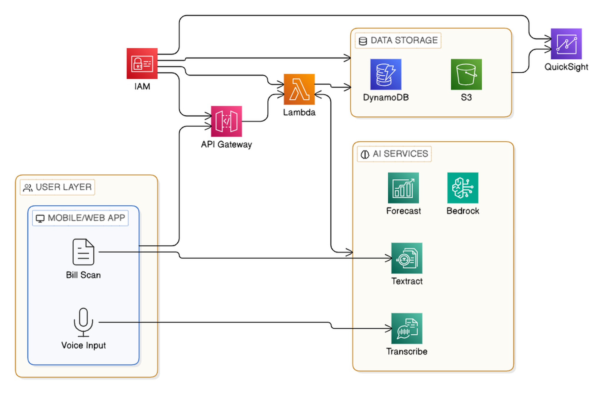

# VyapariAI – AI MBA Business Copilot for Bharat

## System Architecture Overview

VyapariAI is a **serverless, cloud-native AI system** built entirely on AWS services, designed to transform small and rural Indian businesses through voice-first interactions and intelligent document processing. The architecture leverages AWS's managed AI/ML services to provide MBA-level business intelligence while maintaining cost-effectiveness and scalability for millions of users across India.

**Core AWS Architecture Principles:**
- **100% Serverless**: Built using AWS Lambda, API Gateway, and managed services for zero infrastructure management
- **AI-First Design**: Integrated AWS AI services (Transcribe, Textract, Bedrock, Forecast) for intelligent processing
- **Event-Driven Processing**: Asynchronous workflows using AWS EventBridge and Lambda triggers
- **Multi-Language Support**: AWS Transcribe and Bedrock for Hindi and regional Indian languages
- **Cost-Optimized**: Pay-per-use AWS services aligned with small business economics

## High-Level Architecture Diagram



The architecture consists of:

**User Layer:**
- Mobile/Web App with Voice Input and Image Upload capabilities
- Offline Sync functionality for low-connectivity environments

**AWS Cloud Services:**
- **API Gateway**: REST APIs, WebSocket, and Authentication
- **AWS Lambda**: Voice Processor, OCR Processor, Business Logic, AI Orchestrator
- **AWS IAM & Cognito**: Authentication and user management
- **AI/ML Services**: Amazon Transcribe, Textract, Bedrock, Forecast
- **Data Storage**: DynamoDB for structured data, S3 for files and documents
- **Analytics**: QuickSight for business dashboards and reports

## Workflow Overview


The system processes user inputs through multiple channels:
1. **Voice Input**: Record sales & purchases through natural language
2. **OCR Processing**: Scan & digitize bills, invoices, and paper registers
3. **AI Processing**: Voice & AI processing in the cloud
4. **Business Intelligence**: Generate insights, reports, and recommendations
5. **Offline Support**: Function in low-internet environments with sync capabilities

## 2. System Components

### 2.1 Frontend - Mobile Application

#### 2.1.1 Voice Interface Module
- **Voice Recording**: Continuous and push-to-talk recording modes
- **Real-time Transcription**: Local speech-to-text for immediate feedback
- **Voice Playback**: Text-to-speech for system responses
- **Noise Cancellation**: Background noise filtering for better accuracy

#### 2.1.2 Camera/OCR Module
- **Document Capture**: Optimized camera interface for bill scanning
- **Image Enhancement**: Auto-crop, brightness adjustment, perspective correction
- **Offline OCR**: Basic text extraction without internet connectivity
- **Batch Processing**: Multiple document scanning and queuing

#### 2.1.3 Offline Storage
- **Local Database**: SQLite for offline transaction storage
- **Sync Manager**: Intelligent synchronization when connectivity available
- **Conflict Resolution**: Handle data conflicts during sync
- **Data Compression**: Minimize storage footprint

### 2.2 API Gateway Layer

#### 2.2.1 Authentication Service
- **JWT Token Management**: Secure token-based authentication
- **Multi-Factor Authentication**: SMS-based verification for security
- **Session Management**: Handle concurrent sessions across devices
- **Rate Limiting**: Prevent API abuse and ensure fair usage

#### 2.2.2 Request Routing
- **Load Balancing**: Distribute requests across service instances
- **Circuit Breaker**: Handle service failures gracefully
- **Request Validation**: Input sanitization and validation
- **Response Caching**: Cache frequently requested data

### 2.3 Core Services

#### 2.3.1 Voice Processing Service
```
Technologies: AWS Transcribe, Amazon Polly, Custom NLP Models
```

**Components:**
- **Speech-to-Text Engine**: Convert voice to text in multiple languages
- **Natural Language Understanding**: Extract intent and entities from voice commands
- **Text-to-Speech Engine**: Generate natural voice responses
- **Language Detection**: Automatically detect spoken language
- **Voice Command Parser**: Parse business-specific voice commands

**Key Features:**
- Support for Hindi, English, and 5+ regional languages
- Context-aware conversation handling
- Voice biometric authentication
- Noise-robust speech recognition

#### 2.3.2 OCR and Document Processing Service
```
Technologies: AWS Textract, Amazon Rekognition, Custom ML Models
```

**Components:**
- **Image Preprocessing**: Enhance image quality for better OCR
- **Text Extraction**: Extract text from images and PDFs
- **Handwriting Recognition**: Process handwritten business records
- **Data Validation**: Verify extracted data accuracy
- **Document Classification**: Identify document types (bills, receipts, registers)

**Key Features:**
- Multi-language OCR support
- Handwritten text recognition
- Table and form data extraction
- Invoice and receipt parsing

#### 2.3.3 Business Intelligence Service
```
Technologies: AWS QuickSight, Amazon Forecast, Custom Analytics
```

**Components:**
- **Sales Analytics**: Real-time sales tracking and analysis
- **Inventory Management**: Stock level monitoring and optimization
- **Demand Forecasting**: Predict future product demand
- **Profit Analysis**: Calculate margins and profitability metrics
- **Trend Analysis**: Identify business patterns and trends

**Key Features:**
- Real-time dashboard generation
- Predictive analytics for inventory
- Comparative business analysis
- Seasonal trend identification

#### 2.3.4 GST and Compliance Service
```
Technologies: Custom Business Logic, External GST APIs
```

**Components:**
- **GST Calculator**: Automatic tax calculations
- **Invoice Generator**: GST-compliant invoice creation
- **Return Filing**: Automated GST return preparation
- **Compliance Checker**: Verify regulatory compliance
- **Notification Service**: Tax deadline reminders

**Key Features:**
- Real-time GST rate updates
- Multi-state GST handling
- Automated compliance reporting
- Integration with government portals

#### 2.3.5 AI Advisory Service
```
Technologies: Amazon Bedrock, Custom ML Models, Knowledge Graphs
```

**Components:**
- **Business Advisor**: Personalized business recommendations
- **Market Intelligence**: Competitor and market analysis
- **Growth Strategies**: Business expansion recommendations
- **Cost Optimization**: Expense reduction suggestions
- **Risk Assessment**: Business risk evaluation

**Key Features:**
- Contextual business advice
- Industry-specific recommendations
- Personalized growth strategies
- Risk mitigation suggestions

### 2.4 Data Layer

#### 2.4.1 Primary Database (Amazon DynamoDB)
```
Purpose: User data, transactions, business records
```

**Tables:**
- **Users**: User profiles and authentication data
- **Businesses**: Business information and settings
- **Transactions**: Sales and purchase records
- **Inventory**: Product and stock information
- **Analytics**: Processed business metrics

**Design Patterns:**
- Single-table design for related entities
- Global Secondary Indexes for query patterns
- Time-series partitioning for transaction data
- Auto-scaling based on usage patterns

#### 2.4.2 Document Storage (Amazon S3)
```
Purpose: Images, audio files, generated reports
```

**Buckets:**
- **voice-recordings**: Encrypted voice command files
- **document-images**: Scanned bills and receipts
- **generated-reports**: PDF reports and invoices
- **ml-training-data**: Data for model training

**Features:**
- Lifecycle policies for cost optimization
- Cross-region replication for disaster recovery
- Server-side encryption for data security
- Intelligent tiering for storage optimization

#### 2.4.3 Analytics Database (Amazon Redshift)
```
Purpose: Business intelligence and reporting
```

**Schema:**
- **fact_sales**: Sales transaction facts
- **dim_products**: Product dimension data
- **dim_time**: Time dimension for analytics
- **agg_daily_sales**: Pre-aggregated daily metrics

**Features:**
- Columnar storage for analytical queries
- Automated backup and recovery
- Workload management for query optimization
- Integration with QuickSight for visualization

#### 2.4.4 Cache Layer (Amazon ElastiCache)
```
Purpose: Session data, frequently accessed information
```

**Cache Types:**
- **Redis Cluster**: Session management and real-time data
- **Memcached**: Query result caching
- **Application Cache**: Frequently accessed business data

## 3. Data Flow Architecture

### 3.1 Voice Command Processing Flow

```
1. User speaks command → Mobile App
2. Local voice recording → Voice Processing Service
3. Speech-to-text conversion → NLP Processing
4. Intent extraction → Business Logic Service
5. Action execution → Database Update
6. Response generation → Text-to-speech
7. Voice response → User
```

### 3.2 Document Processing Flow

```
1. User captures document → Mobile App
2. Image preprocessing → OCR Service
3. Text extraction → Data validation
4. Structured data creation → Database storage
5. Business logic processing → Analytics update
6. Confirmation response → User notification
```

### 3.3 Analytics Generation Flow

```
1. Transaction data → Real-time processing
2. Data aggregation → Analytics service
3. ML model inference → Insights generation
4. Report creation → Dashboard update
5. Notification trigger → User alert
```

## 4. Security Architecture

### 4.1 Authentication and Authorization

#### 4.1.1 Multi-Factor Authentication
- **Primary**: Phone number verification via SMS OTP
- **Secondary**: Voice biometric authentication
- **Backup**: Security questions in user's preferred language

#### 4.1.2 Role-Based Access Control
- **Business Owner**: Full access to all business data
- **Employee**: Limited access based on assigned roles
- **Accountant**: Access to financial and tax data only
- **Viewer**: Read-only access to reports and analytics

### 4.2 Data Security

#### 4.2.1 Encryption
- **Data in Transit**: TLS 1.3 for all API communications
- **Data at Rest**: AES-256 encryption for all stored data
- **Voice Data**: End-to-end encryption for voice recordings
- **PII Data**: Additional encryption layer for sensitive information

#### 4.2.2 Data Privacy
- **Data Localization**: All data stored within Indian borders
- **Anonymization**: Personal data anonymized for analytics
- **Retention Policies**: Automatic data deletion after retention period
- **User Consent**: Granular consent management for data usage

### 4.3 Infrastructure Security

#### 4.3.1 Network Security
- **VPC Isolation**: Services isolated in private subnets
- **Security Groups**: Restrictive firewall rules
- **WAF Protection**: Web application firewall for API endpoints
- **DDoS Protection**: AWS Shield for DDoS mitigation

#### 4.3.2 Monitoring and Compliance
- **CloudTrail**: Audit logging for all AWS API calls
- **GuardDuty**: Threat detection and security monitoring
- **Config**: Compliance monitoring and configuration management
- **Security Hub**: Centralized security findings management

## 5. Performance and Scalability

### 5.1 Performance Requirements

#### 5.1.1 Response Time Targets
- **Voice Recognition**: < 2 seconds for transcription
- **OCR Processing**: < 5 seconds for document processing
- **API Responses**: < 1 second for data retrieval
- **Report Generation**: < 10 seconds for standard reports

#### 5.1.2 Throughput Targets
- **Concurrent Users**: 100,000 simultaneous users
- **Voice Commands**: 1 million commands per hour
- **Document Processing**: 500,000 documents per day
- **API Requests**: 10 million requests per day

### 5.2 Scalability Architecture

#### 5.2.1 Horizontal Scaling
- **Auto Scaling Groups**: Automatic instance scaling based on load
- **Load Balancers**: Distribute traffic across multiple instances
- **Database Sharding**: Partition data across multiple database instances
- **CDN Distribution**: Global content delivery for static assets

#### 5.2.2 Vertical Scaling
- **Instance Types**: Right-sizing based on workload characteristics
- **Database Scaling**: Read replicas for read-heavy workloads
- **Cache Optimization**: Multi-tier caching for performance
- **Storage Optimization**: Appropriate storage types for different data

### 5.3 Monitoring and Observability

#### 5.3.1 Application Monitoring
- **CloudWatch**: System and application metrics
- **X-Ray**: Distributed tracing for request flows
- **Custom Metrics**: Business-specific performance indicators
- **Real-time Dashboards**: Live system health monitoring

#### 5.3.2 Alerting and Incident Response
- **Automated Alerts**: Threshold-based alerting for critical metrics
- **Escalation Policies**: Multi-tier incident response procedures
- **Runbooks**: Automated remediation for common issues
- **Post-incident Analysis**: Continuous improvement processes

## 6. Integration Architecture

### 6.1 External Integrations

#### 6.1.1 Government Services
- **GST Network (GSTN)**: Direct integration for tax filing
- **Income Tax Department**: TDS and advance tax calculations
- **Ministry of Corporate Affairs**: Business registration verification
- **State Commercial Tax Departments**: Local tax compliance

#### 6.1.2 Financial Services
- **Payment Gateways**: UPI, credit card, and digital wallet integration
- **Banking APIs**: Account balance and transaction verification
- **Credit Scoring**: Integration with credit bureaus for business loans
- **Insurance Providers**: Business insurance recommendations

#### 6.1.3 Market Data Providers
- **Commodity Exchanges**: Real-time price data for agricultural products
- **Industry Reports**: Market research and trend analysis
- **Weather Services**: Weather impact on business operations
- **Economic Indicators**: Macro-economic data for business planning

### 6.2 API Design

#### 6.2.1 RESTful API Standards
- **Resource-based URLs**: Clear, intuitive endpoint naming
- **HTTP Methods**: Proper use of GET, POST, PUT, DELETE
- **Status Codes**: Consistent HTTP status code usage
- **Error Handling**: Standardized error response format

#### 6.2.2 API Versioning
- **URL Versioning**: Version numbers in API endpoints
- **Backward Compatibility**: Support for previous API versions
- **Deprecation Policy**: Clear timeline for API version retirement
- **Migration Support**: Tools and documentation for API upgrades

## 7. Deployment Architecture

### 7.1 Infrastructure as Code

#### 7.1.1 AWS CloudFormation
- **Template Management**: Version-controlled infrastructure templates
- **Stack Management**: Environment-specific stack deployment
- **Parameter Management**: Secure parameter storage and retrieval
- **Change Management**: Controlled infrastructure updates

#### 7.1.2 CI/CD Pipeline
- **Source Control**: Git-based version control with branching strategy
- **Build Automation**: Automated testing and build processes
- **Deployment Automation**: Blue-green deployment for zero downtime
- **Rollback Procedures**: Automated rollback for failed deployments

### 7.2 Environment Management

#### 7.2.1 Environment Strategy
- **Development**: Individual developer environments for testing
- **Staging**: Production-like environment for integration testing
- **Production**: Live environment with high availability setup
- **Disaster Recovery**: Cross-region backup environment

#### 7.2.2 Configuration Management
- **Environment Variables**: Secure configuration parameter management
- **Feature Flags**: Runtime feature toggling for controlled rollouts
- **Secrets Management**: AWS Secrets Manager for sensitive data
- **Configuration Validation**: Automated configuration testing

## 8. Disaster Recovery and Business Continuity

### 8.1 Backup Strategy

#### 8.1.1 Data Backup
- **Database Backups**: Automated daily backups with point-in-time recovery
- **File Storage Backups**: Cross-region replication for document storage
- **Configuration Backups**: Infrastructure and application configuration backups
- **Backup Testing**: Regular backup restoration testing

#### 8.1.2 Recovery Procedures
- **RTO Target**: 4 hours for full system recovery
- **RPO Target**: 1 hour maximum data loss
- **Automated Recovery**: Scripted recovery procedures for common failures
- **Manual Procedures**: Documented manual recovery steps for complex scenarios

### 8.2 High Availability

#### 8.2.1 Multi-AZ Deployment
- **Database Replication**: Multi-AZ database deployment for failover
- **Application Redundancy**: Services deployed across multiple availability zones
- **Load Balancing**: Health checks and automatic failover
- **Data Synchronization**: Real-time data replication across zones

#### 8.2.2 Fault Tolerance
- **Circuit Breakers**: Prevent cascade failures in service dependencies
- **Retry Logic**: Intelligent retry mechanisms for transient failures
- **Graceful Degradation**: Reduced functionality during partial outages
- **Health Monitoring**: Continuous health checks and automatic recovery

## 9. Cost Optimization

### 9.1 Resource Optimization

#### 9.1.1 Compute Optimization
- **Right-sizing**: Regular analysis and adjustment of instance sizes
- **Reserved Instances**: Long-term commitments for predictable workloads
- **Spot Instances**: Cost-effective compute for batch processing
- **Auto Scaling**: Dynamic scaling based on actual demand

#### 9.1.2 Storage Optimization
- **Lifecycle Policies**: Automatic data archiving and deletion
- **Storage Classes**: Appropriate storage tiers for different data types
- **Compression**: Data compression to reduce storage costs
- **Deduplication**: Eliminate duplicate data storage

### 9.2 Operational Efficiency

#### 9.2.1 Automation
- **Infrastructure Automation**: Reduce manual operational overhead
- **Monitoring Automation**: Automated alerting and response
- **Deployment Automation**: Reduce deployment time and errors
- **Maintenance Automation**: Automated system maintenance tasks

#### 9.2.2 Resource Monitoring
- **Cost Tracking**: Detailed cost analysis and reporting
- **Usage Analytics**: Resource utilization monitoring and optimization
- **Budget Alerts**: Automated alerts for cost threshold breaches
- **Optimization Recommendations**: Regular cost optimization reviews

## 10. Compliance and Governance

### 10.1 Regulatory Compliance

#### 10.1.1 Data Protection
- **GDPR Compliance**: European data protection standards
- **Indian Data Protection**: Compliance with local data protection laws
- **Industry Standards**: Adherence to relevant industry regulations
- **Audit Trails**: Comprehensive logging for compliance auditing

#### 10.1.2 Financial Compliance
- **GST Compliance**: Accurate tax calculations and reporting
- **Accounting Standards**: Adherence to Indian accounting principles
- **Financial Reporting**: Standardized financial report generation
- **Audit Support**: Tools and data for financial audits

### 10.2 Governance Framework

#### 10.2.1 Data Governance
- **Data Quality**: Automated data quality checks and validation
- **Data Lineage**: Track data flow and transformations
- **Access Control**: Role-based data access management
- **Data Retention**: Automated data lifecycle management

#### 10.2.2 Operational Governance
- **Change Management**: Controlled change approval processes
- **Risk Management**: Regular risk assessment and mitigation
- **Performance Management**: SLA monitoring and reporting
- **Vendor Management**: Third-party service provider oversight

## 11. Future Enhancements

### 11.1 Advanced AI Features

#### 11.1.1 Predictive Analytics
- **Customer Behavior Prediction**: Anticipate customer purchasing patterns
- **Market Trend Analysis**: Predict market changes and opportunities
- **Risk Prediction**: Early warning systems for business risks
- **Optimization Algorithms**: AI-driven business process optimization

#### 11.1.2 Natural Language Processing
- **Conversational AI**: More natural and context-aware conversations
- **Sentiment Analysis**: Customer feedback and market sentiment analysis
- **Content Generation**: Automated report and document generation
- **Language Expansion**: Support for additional regional languages

### 11.2 Platform Extensions

#### 11.2.1 Ecosystem Integration
- **Marketplace Integration**: Connect with e-commerce platforms
- **Supply Chain Integration**: Supplier and distributor connectivity
- **Financial Services**: Integrated lending and insurance services
- **Government Services**: Expanded government service integration

#### 11.2.2 Advanced Features
- **IoT Integration**: Smart device connectivity for automated data collection
- **Blockchain**: Secure and transparent transaction recording
- **AR/VR**: Immersive business analytics and training
- **Edge Computing**: Local processing for improved performance

## 12. Performance Optimization

### 12.1 Cost Optimization

**Intelligent Caching Strategy:**
```python
# Implement intelligent caching to reduce AWS service calls
class IntelligentCache:
    def __init__(self):
        self.cache = {}
        self.ttl = {}
    
    def get_with_forecast_cache(self, product_id, user_id):
        cache_key = f"{user_id}:{product_id}"
        current_time = time.time()
        
        if cache_key in self.cache and current_time < self.ttl[cache_key]:
            return self.cache[cache_key]
        
        # Fetch from Amazon Forecast only if cache miss
        forecast_data = call_amazon_forecast(product_id, user_id)
        self.cache[cache_key] = forecast_data
        self.ttl[cache_key] = current_time + 3600  # 1 hour TTL
        
        return forecast_data
```

**AWS Cost Optimization Techniques:**
- **Lambda@Edge**: Regional processing to reduce latency and data transfer costs
- **DynamoDB Accelerator (DAX)**: Microsecond latency with reduced read costs
- **S3 Intelligent Tiering**: Automatic cost optimization for storage
- **Reserved Capacity**: Long-term commitments for predictable workloads

### 12.2 Latency Optimization

**Performance Enhancement Strategies:**
- **API Gateway Response Caching**: Cache frequently requested data
- **Predictive Prefetching**: Anticipate user needs and preload data
- **Connection Pooling**: Reuse database connections across Lambda invocations
- **Batch Processing**: Group similar operations to reduce overhead

### 12.3 Monitoring and Observability

**CloudWatch Dashboard Configuration:**
```yaml
# CloudWatch Dashboard for VyapariAI monitoring
VyapariAIDashboard:
  Type: AWS::CloudWatch::Dashboard
  Properties:
    DashboardBody: !Sub |
      {
        "widgets": [
          {
            "type": "metric",
            "properties": {
              "metrics": [
                ["AWS/Lambda", "Duration", "FunctionName", "VoiceProcessor"],
                ["AWS/Lambda", "Errors", "FunctionName", "VoiceProcessor"],
                ["AWS/DynamoDB", "ConsumedReadCapacityUnits", "TableName", "VyapariAI-Sales"],
                ["AWS/Transcribe", "TranscriptionJobsCompleted"],
                ["AWS/Textract", "ResponseTime"]
              ],
              "period": 300,
              "stat": "Average",
              "region": "ap-south-1",
              "title": "VyapariAI Performance Metrics"
            }
          }
        ]
      }
```

**Key Performance Indicators:**
- Voice processing latency < 2 seconds
- OCR processing accuracy > 90%
- API response time < 1 second
- System availability > 99.5%

## 13. Development and Deployment Strategy

### 13.1 Infrastructure as Code

**AWS SAM Template Structure:**
```yaml
# SAM template for VyapariAI deployment
AWSTemplateFormatVersion: '2010-09-09'
Transform: AWS::Serverless-2016-10-31

Parameters:
  Environment:
    Type: String
    Default: dev
    AllowedValues: [dev, staging, prod]

Resources:
  # API Gateway
  VyapariAIApi:
    Type: AWS::Serverless::Api
    Properties:
      StageName: !Ref Environment
      Cors:
        AllowMethods: "'*'"
        AllowHeaders: "'*'"
        AllowOrigin: "'*'"

  # Lambda Functions
  VoiceProcessorFunction:
    Type: AWS::Serverless::Function
    Properties:
      CodeUri: src/voice-processor/
      Handler: app.lambda_handler
      Runtime: python3.11
      MemorySize: 1024
      Timeout: 300
      Environment:
        Variables:
          DYNAMODB_TABLE: !Ref SalesTable
          S3_BUCKET: !Ref DataBucket
```

### 13.2 CI/CD Pipeline

**Deployment Stages:**
1. **Development**: Individual developer environments
2. **Staging**: Production-like testing environment
3. **Production**: Live environment with blue-green deployment
4. **Rollback**: Automated rollback procedures for failed deployments

### 13.3 Testing Strategy

**Comprehensive Testing Approach:**
- **Unit Tests**: Individual function testing with mocking
- **Integration Tests**: AWS service interaction testing
- **Load Tests**: Performance validation under high load
- **Security Tests**: Vulnerability scanning and penetration testing

## 14. Limitations and Future Enhancements

### 14.1 Current Limitations

**Technical Constraints:**
- Voice recognition accuracy varies with background noise and regional accents
- OCR performance depends on image quality and lighting conditions
- Offline functionality limited without internet connectivity
- Regional language support initially limited to major Indian languages

**Business Constraints:**
- Requires smartphone with camera and microphone capabilities
- Learning curve for users with zero digital literacy
- Dependency on AWS service availability and pricing
- Limited integration with existing accounting software

### 14.2 Future Enhancement Roadmap

**Phase 2 Enhancements (6-12 months):**
- **Advanced AI Features**: Computer vision for product recognition, sentiment analysis
- **Integration Capabilities**: Banking APIs, e-commerce platforms, government portals
- **Enhanced UX**: Augmented reality, voice-based reporting, collaborative features

**Phase 3 Enhancements (12-24 months):**
- **Ecosystem Expansion**: B2B marketplace, micro-lending, insurance integration
- **Advanced Analytics**: Fraud detection, customer lifetime value prediction
- **Technology Evolution**: Edge computing, 5G integration, blockchain, IoT

This comprehensive design document provides a detailed technical blueprint for building VyapariAI as a scalable, AI-powered business management platform specifically tailored for the Indian small business ecosystem, leveraging the full spectrum of AWS services while maintaining cost-effectiveness and accessibility.